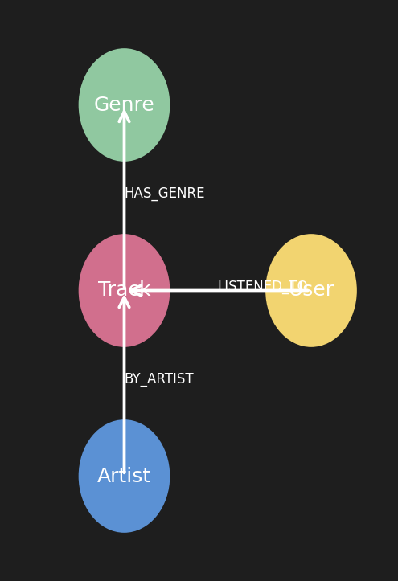

# Recomendacao musical com Neo4j

Projeto em Python para explorar recomendacoes musicais a partir de um grafo no Neo4j, usando dados de faixas, artistas, generos e interacoes de usuarios.

## Estrutura do grafo



## Requisitos

- Python 3.11+ (ou compatível)
- Neo4j 5+ rodando localmente ou na nuvem
- Dependencias do projeto: `pip install -r requirements.txt`

## Configuracao

1) Crie e ative um ambiente virtual:
   - Windows: `python -m venv .venv && .\\.venv\\Scripts\\activate`
   - Linux/macOS: `python -m venv .venv && source .venv/bin/activate`
2) Instale as dependencias: `pip install -r requirements.txt`
3) Crie um arquivo `.env` na raiz com as variaveis:
   - `NEO4J_URI`
   - `NEO4J_USERNAME`
   - `NEO4J_PASSWORD`
   - `NEO4J_DATABASE` (opcional; padrao `neo4j`)
4) Opcional: valide as credenciais executando um teste rapido:

```python
from neo4j_config import get_driver

with get_driver().session() as session:
    result = session.run("RETURN 1 AS ok").single()
    print(result["ok"])
```

## Como usar

- `data_music.ipynb`: exploracao e limpeza dos datasets CSV.
- `music_graph.ipynb`: criacao de nos e relacionamentos no Neo4j a partir dos dados tratados.
- `neo4j_config.py`: carregamento de credenciais e criacao do driver Neo4j via `.env`.
- `requirements.txt`: lista as dependencias minimas.

Para trabalhar nos notebooks:
```bash
jupyter notebook data_music.ipynb
jupyter notebook music_graph.ipynb
```

## Dados

- `music_info.csv` e `music_info_export.csv`: informacoes de faixas, artistas e generos.
- `user_listening.csv` e `user_listening_export.csv`: historico de execucoes dos usuarios.
- `user_profiles_export.csv`: dados adicionais de perfil dos usuarios.

## Estrutura de pastas

- `docs/neo4j-schema.png`: diagrama do grafo.
- `neo4j_config.py`: helper de conexao.
- `*.ipynb`: fluxos de ETL e carregamento do grafo.
- `*.csv`: bases de entrada.

## Licenca

Defina a licenca desejada (por exemplo, MIT) ou ajuste esta secao conforme a politica do projeto.
